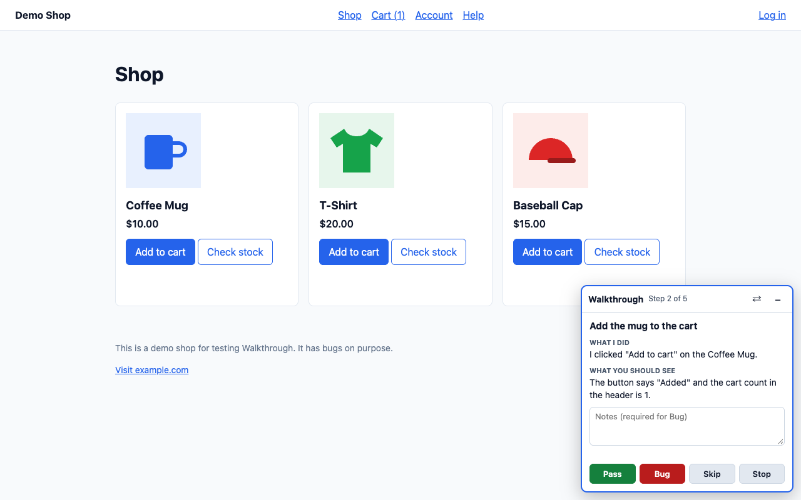
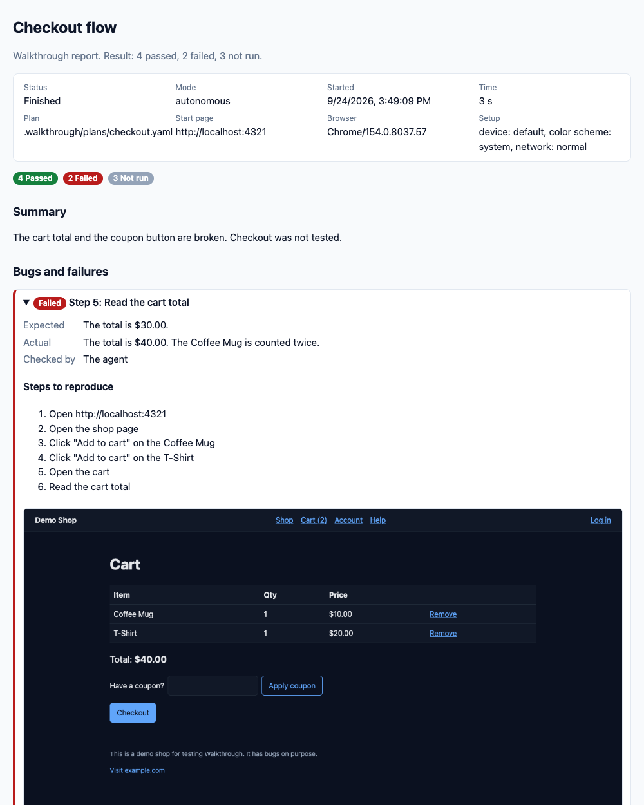

# Walkthrough

Walkthrough lets an AI agent test your web app in a real, visible browser, one step at a time, with you. After each step, the agent tells you what it did and what you should see. You answer in a small panel in the browser: **Pass**, **Bug**, **Skip**, or **Stop**. When you report a bug, Walkthrough saves a screenshot, the console errors, and the failed requests, and it writes a report.



Walkthrough is a [Claude Code](https://code.claude.com) plugin with an MCP server inside. The server (`uiwalk`) controls Chrome with Puppeteer. The plugin adds a skill and slash commands that teach the agent how to test with you. Other MCP clients, such as Claude Desktop, Cursor, and VS Code, can use the server too.

> Status: version 0.1, early. Expect changes.

## What it does

- **Step-by-step testing.** The agent does a step, checks it, and asks you to confirm it. You watch in a real browser, and a pulsing box shows each element before the agent uses it.
- **Test plans in YAML.** Save a test in `.walkthrough/plans/` and run it again later. Your editor gives autocomplete. Three modes set how many steps you confirm: every step, only marked steps, or none.
- **Reports.** Each run writes `report.md` and a single-file `report.html`, with bugs first, steps to reproduce, screenshots, and errors.
- **Evidence.** Screenshots with a red box on the element, console errors, page errors, and failed requests.
- **Record mode.** Use the app yourself, and Walkthrough turns your clicks and typing into a draft plan.
- **More checks.** Visual checks against saved baselines, accessibility audits with axe-core, phone and tablet screens, dark mode, and slow networks.
- **Sharing.** Export a run as a plain Puppeteer script for CI. Turn a bug into a GitHub issue draft.



## Safe by default

- Walkthrough opens only the sites that you allow. By default, that is `localhost`.
- Passwords go in `.walkthrough/.env` and appear in plans as `{{secret:NAME}}`. The agent never sees the values.
- Text from web pages is marked as data, so the agent does not follow instructions from a page.
- Page scripts cannot see the panel or fake your answers.
- The tool that runs page JavaScript is off unless you turn it on for yourself.

Read more in [Safety](docs/safety.md).

## Requirements

- Node.js 22.12 or later
- Google Chrome. If it is missing, `/walkthrough:doctor` can download Chrome for Testing.
- Claude Code, for the plugin. Other MCP clients can use the server alone.

## Quick start

1. In Claude Code, add the marketplace and install the plugin:

   ```text
   /plugin marketplace add mrigsby/walkthrough
   /plugin install walkthrough@walkthrough
   ```

2. Start your app. Then, in your project, set up Walkthrough with the address of your app:

   ```text
   /walkthrough:init http://localhost:3000
   ```

3. Run the sample plan. Chrome opens, and the panel asks you to confirm the step:

   ```text
   /walkthrough:run smoke
   ```

4. Ask for a real test in plain words, such as "walk me through the checkout and ask me to confirm each step". Or write a plan with `/walkthrough:plan`.

The [getting started guide](docs/getting-started.md) has the details.

## Commands

| Command | What it does |
| --- | --- |
| `/walkthrough:init [url]` | Makes the `.walkthrough` folder with settings and a sample plan. |
| `/walkthrough:run [plan] [mode]` | Runs a test plan in the browser. |
| `/walkthrough:plan <what to test>` | Writes a new test plan from a description. |
| `/walkthrough:record [name]` | Records you as you use the app, and drafts a plan from it. |
| `/walkthrough:report [run]` | Shows the result of a run and writes its reports again. |
| `/walkthrough:export [run]` | Turns a finished run into a Puppeteer script for CI. |
| `/walkthrough:bug [run] [step]` | Drafts a GitHub issue for a bug and opens the issue page for you. |
| `/walkthrough:doctor` | Checks the setup and explains how to fix problems. |

You can also ask in plain words. The walkthrough skill loads when you ask the agent to walk through, click through, or visually test a page.

## Files in your project

```text
.walkthrough/
  config.yaml        Settings. Commit it.
  config.local.yaml  Your own settings. Git does not track it.
  plans/             Test plans. Commit them.
  plan.schema.json   Autocomplete for plans. Commit it.
  baselines/         Screenshots for visual checks. Commit them if your team shares them.
  exports/           Puppeteer scripts from runs.
  .env               Secrets. Git does not track it.
  sessions/          Saved logins. Git does not track them.
  runs/              Results and reports. Git does not track them.
```

## Documentation

- [Getting started](docs/getting-started.md)
- [Test plan format](docs/plan-format.md)
- [Settings](docs/config.md)
- [Tools](docs/tools.md)
- [Safety](docs/safety.md)
- [Use with other tools and share with a team](docs/sharing.md)
- [Troubleshooting](docs/troubleshooting.md)

## Work on Walkthrough

See [Contributing](CONTRIBUTING.md). In short:

```sh
npm install
npm run build
npm test
npm run demo
```

The demo shop in `examples/demo-app` has bugs on purpose, so you can try every feature.

## License

MIT. See [LICENSE](LICENSE).
