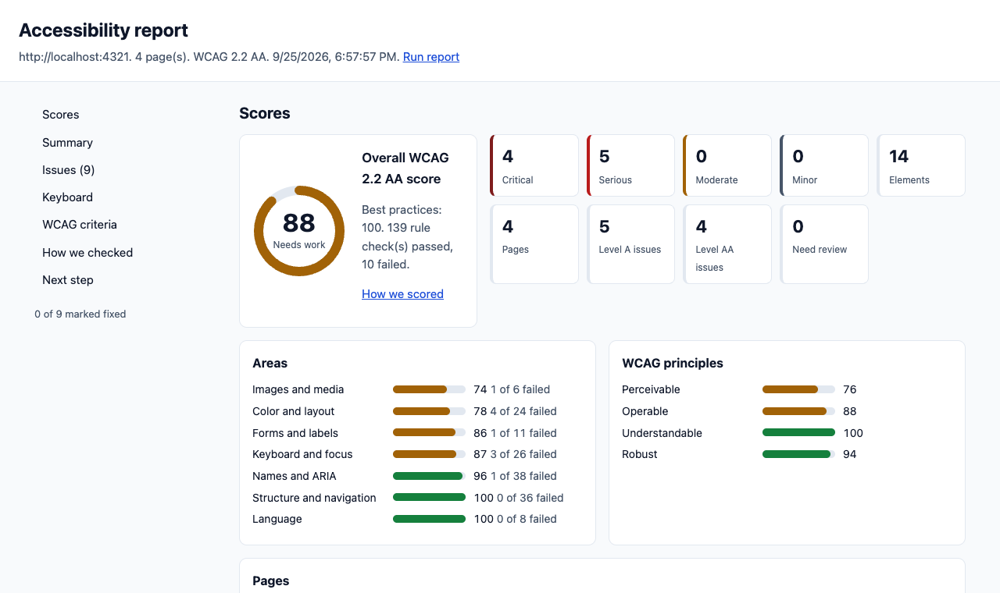

# Accessibility reports

Walkthrough can check one page or a list of pages for accessibility problems, and write a report that you can review and fix from. The agent writes a short explanation and a short fix for each issue. Walkthrough works out the scores, so they are the same every time for the same results.

The report goes in the run folder, next to `report.html`:

- `accessibility.html`: for people. Scores, filters, and a card for each issue. It is one file that works offline.
- `accessibility.md`: for an agent in a new session. It has the same content, with the issue IDs.
- `accessibility.json`: for Walkthrough. The next report reads it to see what changed.



## Make a report

In Claude Code, run `/walkthrough:a11y` with the pages to check:

```text
/walkthrough:a11y / /login /help.html /cart
```

You can also give:

- A text file with one page on each line: `/walkthrough:a11y pages.txt`. The agent skips lines that start with `#`.
- A plan name: `/walkthrough:a11y checkout`. Use a plan for pages that need steps first, such as a cart with items in it. See [Plans](#plans).

The agent:

1. Checks each page with `a11y_scan`. Without a run, this makes a run with one step per page, and `report.html`.
2. Gets the findings with `a11y_report`.
3. Searches your source code for where to fix each issue, if the code is in the project.
4. Writes the explanations and fixes, and calls `a11y_report` again to write the files.
5. Shows you the score, the top issues, the path to `accessibility.html`, and a prompt for the next session.

A scan with all the checks takes about 10 seconds for each page. A long list of pages takes more than one call. The agent goes on with the same run until it has checked all pages.

## What the report shows

- **Scores:** the overall score, counts by impact, WCAG A and AA counts, scores for each area and each WCAG principle, and a score for each page.
- **Summary:** 2 to 4 sentences from the agent.
- **Issues:** one card for each problem type, merged across pages. Each card has an ID, the impact, the WCAG criterion, what is wrong, how to fix it, an example, where to fix it, a screenshot, and the list of elements with their selectors and HTML.
- **Fixed since the last report:** when there is an earlier report of the same pages.
- **Keyboard:** the order in which Tab moves through each page.
- **Needs manual review:** items that axe-core could not decide.
- **WCAG 2.2 criteria:** each level A and AA criterion, with "Problems found", "No problems found by automated checks", or "Needs manual check".
- **How we checked:** the tools, the screen, the color scheme, how the scores work, and the limits.
- **Next step:** the prompt for a new session.

In the HTML report, filter the issues by impact, area, page, WCAG level, and status, or search for an ID, a rule, or a selector. Check **I fixed this** on a card to keep track. Your browser remembers the checks for this report.

## Checks

| Check | What it finds | Setting |
| --- | --- | --- |
| axe-core | Missing names and labels, low contrast, missing alt text, wrong ARIA, page structure, and more. | Always on |
| Keyboard | Keyboard traps, elements with no visible focus, and elements that you can click but cannot reach with Tab. | `keyboard` |
| Dark mode | Text with low contrast in dark mode only. | `darkMode` |
| Reflow | Pages that scroll sideways at 320 pixels wide (WCAG 1.4.10). | `reflow` |
| Frames | The same axe-core problems inside frames on allowed sites, such as a payment form. | `frames` |
| Screenshots | A picture of the first element of each problem, with a red box. | `screenshots` |

All the checks are on by default for a scan. Turn one off in `config.yaml` or in a plan. The `a11y_audit` tool runs axe-core only, unless you ask for more checks.

## Scores

Each rule that applies to a page passes or fails. A rule counts by its impact: critical 10, serious 7, moderate 3, and minor 1. A page score is the part of that weight that passed, from 0 to 100. Lighthouse uses a similar method.

- The overall score adds up all pages. It uses WCAG rules only.
- Best practices, which are not part of WCAG, have their own score.
- 90 to 100 is Good, 50 to 89 is Needs work, and below 50 is Poor.
- Items that need review do not change the score.

A high score does not mean that a page is accessible. It means that the automated checks found few problems.

## Issue IDs and compared reports

Each issue has an ID, such as `A11Y-003`. When you check the same pages again, Walkthrough compares the new report with the last one:

- An issue that is still there keeps its ID, and shows **Still there**.
- A new issue gets the next free ID, and shows **New**.
- An issue that is gone shows under **Fixed since the last report**.

So a plan that names `A11Y-003` still points to the same issue after the next scan.

## Plan the fixes

After the report, the agent shows a prompt like this:

```text
Read .walkthrough/runs/<run>/accessibility.md. It is an accessibility report for http://localhost:3000.
Write a plan to fix the issues. Fix critical and serious issues first. Group the fixes by
source file, and name the issue ID (like A11Y-001) for each fix. When the fixes are done,
run /walkthrough:a11y / /login again. The issue IDs stay the same, so you can check
each fix.
```

Paste it into a new Claude Code session. The Markdown report tells the agent how to use it, and marks page text as data.

## Plans

A plan can check accessibility at any step:

```yaml
name: Checkout accessibility
accessibility:
  report: true
  checks: { screenshots: false }
steps:
  - do: Add the Coffee Mug to the cart
    action: { click: { selector: '[data-add="mug"]' } }
  - do: Open the checkout page
    action: { navigate: /checkout }
    a11y: true
```

See [Accessibility checks](plan-format.md#accessibility-checks) in the plan format.

## Settings

The `accessibility` settings in `config.yaml` set the standard and the checks. See [Settings](config.md#accessibility).

## Limits

- Automated checks find about a third of accessibility problems. Test with a keyboard and a screen reader too.
- The dark mode check uses the `prefers-color-scheme` setting only. Walkthrough does not check a theme switch in the app.
- Walkthrough cannot open frames from other sites. The report lists them.
- Screenshots can show secrets that appear as normal text on a page.
- A report that Walkthrough writes again later, in a new session, can hide only the secrets in `.walkthrough/.env`.
